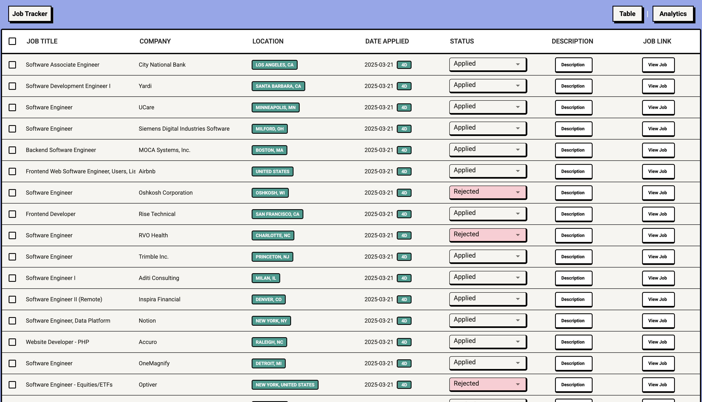

# Job Tracker with Chrome Extension

A chrome extension that allows users to track and manage the jobs they applied to. The extension scrapes the job details, saves it in a CSV, and displays it on a table, allowing users to make changes to the status of their job application.

## UI

### Demo

### Chrome Extension Popup 


### Web Interface



## Features
- Chrome extension allowing users to easily send job links to the backend.
- Scraper that scrapes the job posting, identifying job title, company name, location, and description.
- CSV storage to save job details (job title, company name, location, date applied, status and description).
- Web interface with sorting and pagination.
- Real-time update to the table and CSV file when a new job is saved or user changes job status.
- Job analytics coming soon...

## Installation

### Prerequisites
- Node.js and npm
- Python 3.6+
- Chrome browser

### Backend Dependencies
1. Install Flask and Flask-CORS:
```bash
pip install flask flask-cors
```

### Frontend Dependencies
1. Install Material UI and required packages:
```bash
npm install @mui/material @mui/x-data-grid @emotion/react @emotion/styled
```

### Chrome Extension
1. Clone this repository to your local machine:
```bash
git clone https://github.com/Darsh70/job-tracker.git
```
2. Go to chrome://extensions/ in your browser.
3. Enable Developer mode in the top-right corner.
4. Click Load unpacked and select the directory where you cloned this repository.
5. The extension will appear in your browser's extension bar.

### Frontend
```bash
npm run dev
```
- The frontend will run on http://localhost:5173/

### Backend
```bash
cd server
python3 app.py
```
- The backend will run on http://localhost:5001.

## Usage
1. Find a job posting you're interested in
2. Click the Job Tracker extension icon
3. Confirm to save the job details
4. View and manage your job applications in the web interface
5. Update job application status as you progress through the hiring process